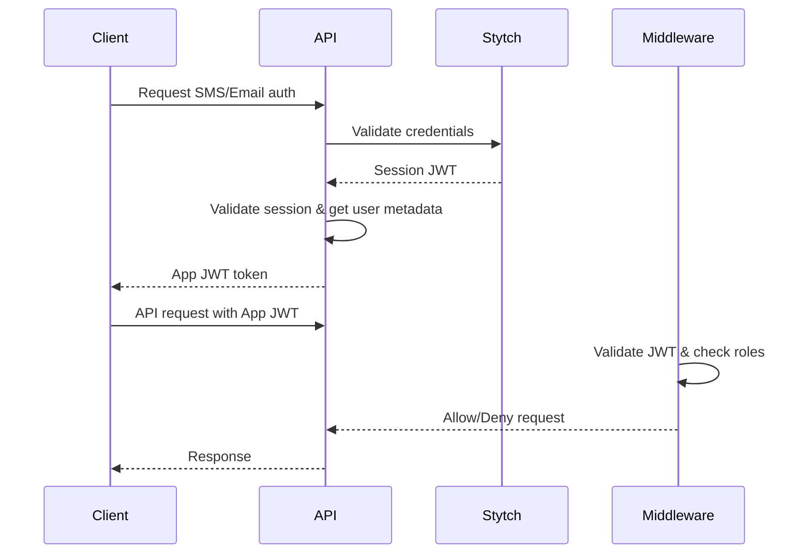

# SideSpins Authentication Middleware Guide

## Overview

The SideSpins API uses a sophisticated JWT-based authentication middleware system that provides secure, role-based access control for Azure Functions endpoints. This system replaces the previous shared API secret approach with a more robust, scalable authentication mechanism.

## Architecture

### Two-Stage Authentication Flow

1. **Stytch Session Authentication**: Users authenticate via Stytch (SMS/Email)
2. **App JWT Generation**: Server generates internal JWT tokens for API access



## Authentication Middleware Components

### 1. AuthenticationMiddleware.cs

The core middleware that:
- Intercepts HTTP requests
- Extracts JWT tokens from headers or cookies
- Validates tokens using `AuthService.ValidateAppJwt()`
- Enforces role-based access control
- Adds user claims to the function context

### 2. RequireAuthenticationAttribute.cs

Declarative attribute for marking functions that require authentication:

```csharp
[RequireAuthentication("player")]    // Minimum role: player
[RequireAuthentication("manager")]   // Minimum role: manager  
[RequireAuthentication("admin")]     // Minimum role: admin
```

### 3. FunctionContextExtensions.cs

Helper methods for accessing user information in functions:

```csharp
var userClaims = context.GetUserClaims();
var userId = context.GetUserId();
var teamId = context.GetTeamId();
var userRole = context.GetTeamRole();
```

## Role Hierarchy

The system implements a three-tier role hierarchy:

| Role | Level | Permissions |
|------|--------|-------------|
| `player` | 1 | Read team data, view matches/lineups |
| `manager` | 2 | All player permissions + create/update teams, players, matches |
| `admin` | 3 | All manager permissions + delete operations |

**Role Inheritance**: Higher roles automatically inherit lower role permissions.

## Endpoint Types

### Anonymous Endpoints

Endpoints that don't require authentication:

```csharp
[Function("GetTeams")]
public async Task<IActionResult> GetTeams(
    [HttpTrigger(AuthorizationLevel.Anonymous, "get")] HttpRequest req)
{
    // No authentication required
    // Anyone can access this endpoint
}
```

**Use Cases**:
- Public data (league standings, public team info)
- Health checks
- Documentation endpoints

### Authenticated Endpoints

Endpoints that require valid JWT tokens:

```csharp
[Function("GetMemberships")]
[RequireAuthentication("player")]
public async Task<IActionResult> GetMemberships(
    [HttpTrigger(AuthorizationLevel.Anonymous, "get")] HttpRequest req,
    FunctionContext context)
{
    // User claims are automatically available
    var userClaims = context.GetUserClaims();
    var userTeamId = context.GetTeamId();
    
    // Implement team-based authorization
    var requestedTeamId = req.Query["teamId"];
    if (userClaims.TeamRole != "admin" && userTeamId != requestedTeamId)
    {
        return new StatusCodeResult(403); // Forbidden
    }
    
    // Business logic here
}
```

## Client Implementation Guide

### 1. Authentication Flow

#### Step 1: Initiate Authentication

```javascript
// Send SMS code
const response = await fetch('/api/auth/sms', {
    method: 'POST',
    headers: { 'Content-Type': 'application/json' },
    body: JSON.stringify({ phoneNumber: '+1234567890' })
});

const { phoneId } = await response.json();
```

#### Step 2: Verify and Get Token

```javascript
// Verify SMS code and get App JWT
const authResponse = await fetch('/api/auth/sms/verify', {
    method: 'POST',
    headers: { 'Content-Type': 'application/json' },
    body: JSON.stringify({ 
        phoneId: phoneId,
        code: '123456'
    })
});

const { sessionToken, claims } = await authResponse.json();

// Store token for subsequent requests
localStorage.setItem('authToken', sessionToken);
localStorage.setItem('userClaims', JSON.stringify(claims));
```

### 2. Making Authenticated API Calls

#### Using Authorization Header (Recommended)

```javascript
const token = localStorage.getItem('authToken');

const response = await fetch('/api/GetMemberships?teamId=123', {
    method: 'GET',
    headers: {
        'Authorization': `Bearer ${token}`,
        'Content-Type': 'application/json'
    }
});

if (response.status === 401) {
    // Token expired or invalid - redirect to login
    redirectToLogin();
} else if (response.status === 403) {
    // Insufficient permissions
    showErrorMessage('You do not have permission to access this resource');
}
```

#### Using Cookies (Alternative)

```javascript
// Set cookie (done automatically by server on login)
document.cookie = `auth_token=${sessionToken}; path=/; httpOnly; secure`;

// Subsequent requests automatically include cookie
const response = await fetch('/api/GetMemberships?teamId=123', {
    method: 'GET',
    credentials: 'include'  // Include cookies
});
```

### 3. Error Handling

```javascript
async function makeAuthenticatedRequest(url, options = {}) {
    const token = localStorage.getItem('authToken');
    
    const response = await fetch(url, {
        ...options,
        headers: {
            'Authorization': `Bearer ${token}`,
            'Content-Type': 'application/json',
            ...options.headers
        }
    });
    
    switch (response.status) {
        case 401:
            // Unauthorized - token expired or invalid
            handleTokenExpired();
            throw new Error('Authentication required');
            
        case 403:
            // Forbidden - insufficient permissions
            throw new Error('Insufficient permissions');
            
        case 200:
        case 201:
            return response.json();
            
        default:
            const error = await response.json();
            throw new Error(error.message || 'Request failed');
    }
}

function handleTokenExpired() {
    localStorage.removeItem('authToken');
    localStorage.removeItem('userClaims');
    window.location.href = '/login';
}
```

### 4. Role-Based UI Logic

```javascript
const userClaims = JSON.parse(localStorage.getItem('userClaims') || '{}');

function canUserAccess(requiredRole) {
    const roleHierarchy = { player: 1, manager: 2, admin: 3 };
    const userLevel = roleHierarchy[userClaims.teamRole] || 0;
    const requiredLevel = roleHierarchy[requiredRole] || 999;
    return userLevel >= requiredLevel;
}

// Example usage in UI
if (canUserAccess('manager')) {
    showCreateTeamButton();
}

if (canUserAccess('admin')) {
    showDeletePlayerButton();
}

// Team-based access
if (userClaims.teamId === currentTeamId || canUserAccess('admin')) {
    showTeamManagementPanel();
}
```

## API Response Formats

### Success Response

```json
{
    "data": { /* response data */ },
    "status": "success"
}
```

### Authentication Error (401)

```json
{
    "error": "Unauthorized",
    "message": "Valid authentication token required"
}
```

### Authorization Error (403)

```json
{
    "error": "Forbidden", 
    "message": "Insufficient permissions for this operation"
}
```

## Security Best Practices

### For Developers

1. **Always use HTTPS** in production
2. **Validate team access** in business logic for team-specific operations
3. **Use minimal required roles** for endpoints
4. **Log security events** for auditing
5. **Implement proper CORS** policies

### For Clients

1. **Store tokens securely** (httpOnly cookies preferred over localStorage)
2. **Implement token refresh** logic
3. **Handle authentication errors** gracefully
4. **Never log sensitive data** including tokens
5. **Implement proper logout** (clear all stored auth data)

## Common Patterns

### Team-Scoped Operations

```csharp
[Function("UpdatePlayer")]
[RequireAuthentication("manager")]
public async Task<IActionResult> UpdatePlayer(
    [HttpTrigger(AuthorizationLevel.Anonymous, "patch", Route = "teams/{teamId}/players/{playerId}")] 
    HttpRequest req, FunctionContext context, string teamId, string playerId)
{
    var userClaims = context.GetUserClaims();
    
    // Managers can only modify their own team (unless admin)
    if (userClaims.TeamRole != "admin" && userClaims.TeamId != teamId)
    {
        return new StatusCodeResult(403);
    }
    
    // Business logic...
}
```

### Conditional Role Requirements

```csharp
[Function("GetPlayerDetails")]
[RequireAuthentication("player")]
public async Task<IActionResult> GetPlayerDetails(
    [HttpTrigger(AuthorizationLevel.Anonymous, "get", Route = "players/{playerId}")] 
    HttpRequest req, FunctionContext context, string playerId)
{
    var userClaims = context.GetUserClaims();
    
    // Players can only see their own details
    // Managers can see their team's players
    // Admins can see any player
    
    if (userClaims.TeamRole == "player" && userClaims.Sub != playerId)
    {
        return new StatusCodeResult(403);
    }
    
    // Additional logic for managers to check team membership...
}
```

## Testing Authentication

### Unit Tests

```csharp
[Test]
public void AuthenticationMiddleware_WithoutToken_Returns401()
{
    // Arrange
    var context = CreateMockFunctionContext();
    var request = CreateMockHttpRequest();
    
    // Act
    var result = middleware.Invoke(context, next);
    
    // Assert
    Assert.AreEqual(401, response.StatusCode);
}
```

### Integration Tests

```javascript
describe('Authentication Tests', () => {
    test('should reject requests without token', async () => {
        const response = await fetch('/api/GetMemberships?teamId=123');
        expect(response.status).toBe(401);
    });
    
    test('should accept requests with valid token', async () => {
        const token = await getValidToken();
        const response = await fetch('/api/GetMemberships?teamId=123', {
            headers: { 'Authorization': `Bearer ${token}` }
        });
        expect(response.status).toBe(200);
    });
});
```

## Migration from Shared Secret

If migrating from the previous shared secret system:

1. **Parallel Operation**: Run both systems temporarily
2. **Update Clients**: Modify client code to use JWT authentication
3. **Remove Legacy Code**: Remove `AuthHelper.ValidateApiSecret()` calls
4. **Update Tests**: Update test scripts to use JWT tokens

## Troubleshooting

### Common Issues

| Issue | Cause | Solution |
|-------|--------|----------|
| 401 on all requests | Missing/invalid JWT | Check token format and expiration |
| 403 on specific endpoints | Insufficient role | Verify user role and endpoint requirements |
| Token not found | Client not sending header | Check Authorization header format |
| Claims null in function | Middleware not registered | Verify middleware registration in Program.cs |

### Debug Logging

Enable detailed logging in `local.settings.json`:

```json
{
    "Values": {
        "AZURE_FUNCTIONS_ENVIRONMENT": "Development",
        "Logging__LogLevel__SidesSpins.Functions": "Debug"
    }
}
```

## Conclusion

The authentication middleware provides a robust, scalable foundation for securing the SideSpins API. By following this guide, developers can implement secure endpoints and clients can integrate authentication seamlessly.

For questions or issues, refer to the source code in `/functions/auth/` or contact the development team.
